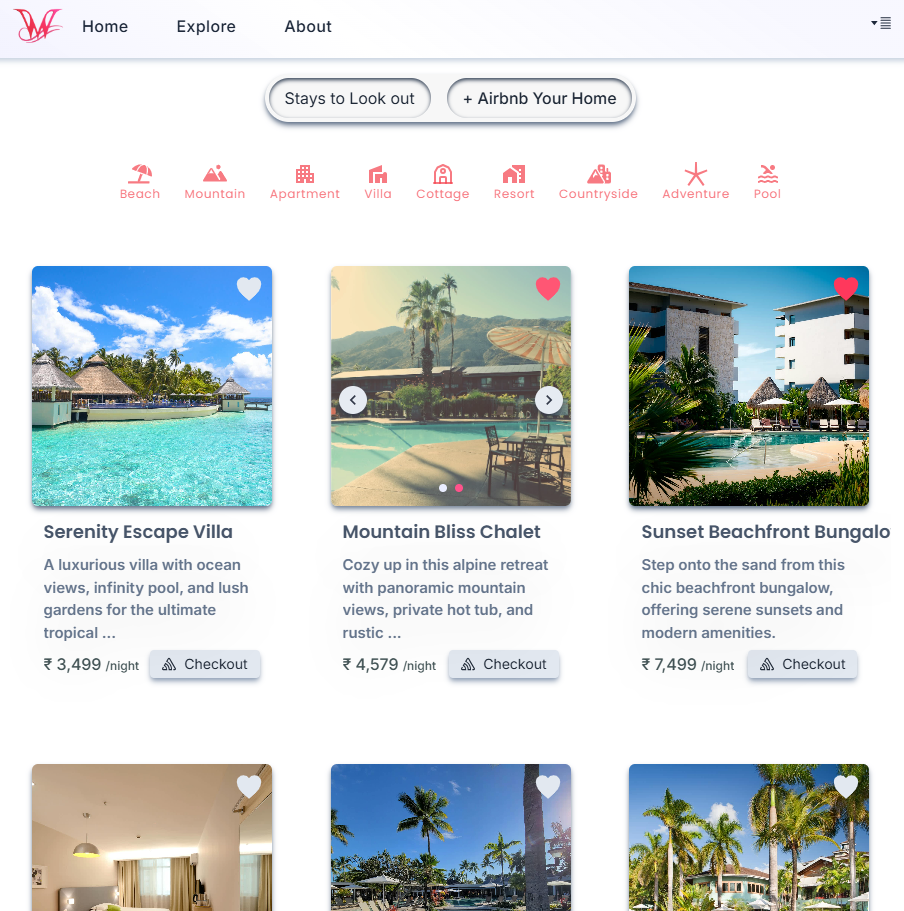

# Wanderlust - Your Stay, Your Way

🔗 [Visit Wanderlust](https://wanderlust-ivory.vercel.app/)

## Introduction

Wanderlust is a full-featured platform connecting travelers with unique accommodation options worldwide. Designed for both visitors and property owners, Wanderlust enables users to explore and book listings, add them to their wishlist, and manage listings with ease.

This document outlines the technical and architectural details of Wanderlust, including the system design, API structure, usage instructions, and future improvement possibilities.

## System Architecture

Wanderlust employs a client-server architecture with three main components: the front end (client), the back end, and the database. The front end serves as the client interface, while the back end and database form the server, handling data processing and storage.

## Front End

The front end is built using ReactJS, offering dynamic and responsive interfaces that enhance the user experience. RESTful APIs enable communication with the back end.

### Pages for Visitors

- **Homepage**: Showcases featured listings and categories for easy browsing.
- **Listing Catalog**: Allows users to view and filter accommodations by category or popularity.
- **Wishlist**: Saves favorite listings for future reference.
- **Profile**: Displays visitor details and enables personal info updates.

### Pages for Property Owners

- **Dashboard**: Offers insights into listing views, feedback, and performance metrics.
- **Listing Management**: Enables owners to create, edit, and delete their accommodations.
- **Profile Management**: Allows owners to manage their personal details and contact information.

### Front-end Tools and Libraries

The front end is developed using the following technologies:

- **ReactJS**: Core framework for the UI.
- **CSS and Tailwind CSS**: Styling and layout management.
- **Framer Motion**: Smooth animations for enhanced user experience.
- **Infinite Scroll**: To optimize performance by loading listings dynamically.

## Back End

Built with Node.js and Express.js, the back end powers Wanderlust’s core functionality, including user authentication, listing management, and data processing. APIs facilitate data exchange between the client and server.

### Back-end Features

- **User Authentication and Authorization**: Separate roles for visitors and property owners with secure OTP-based email login via Nodemailer.
- **Listing Management**: Owners can manage their accommodations, while visitors can browse and save listings.
- **Infinite Scrolling**: Enables seamless, paginated content loading for a smoother user experience.
- **Cloud-based Image Management**: Uses Cloudinary for efficient and scalable image storage and retrieval.

### Back-end Frameworks, Libraries, and Tools

Wanderlust’s back end is constructed with:

- **Node.js**: Core runtime for server-side operations.
- **Express.js**: Framework for web application development.
- **MongoDB**: NoSQL database for flexible, efficient data storage.
- **JWT (JSON Web Tokens)**: Secure token-based authentication.
- **Bcrypt**: For hashing user passwords.
- **Mongoose**: ODM for MongoDB interaction.

## Data Models and Database Schema

Wanderlust uses various schemas to organize data:

- **User Schema**: Details for both visitor and owner accounts, including name, email, and roles.
- **Listing Schema**: Information for each accommodation, including images, location, price, and owner.
- **Wishlist Schema**: Stores listings saved by visitors for easy reference.
- **Review Schema**: Holds feedback and ratings provided by visitors.

## Database

Wanderlust uses MongoDB to manage its data, accommodating structured and semi-structured content effectively. This NoSQL solution enables the efficient storage of listing data, user details, and other essential platform elements.

## API Design

The Wanderlust platform’s API follows REST architectural conventions, using HTTP methods like GET, POST, PUT, and DELETE with JSON data. Node.js and Express.js power the API, supporting seamless integration with the front end.
